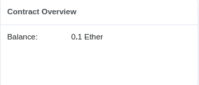

# Tech Blog Place App 💻

This project demonstrates a basic smart contract. It allows users to send
messages to a smart contract, and display it as some kind of a log. 

## __buildspace

This project is the result from following [buildspace](https://buildspace.so/)'s
hands on [course](https://buildspace.so/solidity) "Build a Web3 App on Ethereum
with Solidty + Smart Contracts". It's a free, high quality course and I
personally recommend everyone that wants to start learning how to develop dApps
to go and try out!

## Directory Structure

```
. tech-blog-place-dApp/
|__ app/
| |__ src/
|    |-- pages/Index.vue // Main page
|    |__ utils/WavePortal.json // contract ABI
|  
|__ contract/
  |-- contracts/
  |  |__ WavePortal.sol // Contract source
  |-- scripts/
  |  |-- run.js
  |  |__ deploy.js
  |__ test/
```

The `deploy.js` script will compile and deploy the smart contract using `Hardhat`.

To deploy to the `Goerli` testnet, run `npm run deploy -- --network goerli`

## Learning Log

<details>
  <summary>2020-08-26 12:32</summary>

  Checkpoint -
  [d63bd3b](https://github.com/Dolpheyn/wave-portal-dApp/commit/d63bd3bb0e8346a23fc7d91b250514bcc49f3785)

  -- Created a smart contract with a local state `totalWaves` and two methods,
  one to mutate the state by incrementing it and another to access and return
  its value.

  The mutating method(similar to `POST` HTTP method, setter methods in Java or
  methods that requires `mut self` in Rust) also accesses a global state that
  every contracts have access to -- `msg`. We accessed the `msg.sender` variable
  which holds the address of whoever that sends the transaction.

  The global variables exist because when a function in our smart contract is
  called/invoked, it's actually the blockchain that does it, and the blockchain
  sends along the `calldata`, which is the metadata from the external function
  call.

  Here's how I picture it:
  ```
       (1)                              (2)
  user ---------------------> blockhain ---------------> contract (addr - 0xfoo)
        "pls invoke function            "pls invoke `increment`,
         `increment` on contract         and here's what you
         with address 0xfoo"             need to know about this
                                         transaction (in `msg`)"
  ```

  Note: The process in (2) is the one that requires the famous term `mining` or
  `validating` (i think so). Without any stakeholders that validate your
  transaction, the transaction wouldn't be made.

  Along with `sender`, there's also other accessable variables in the `msg`
  global variable:

  - `data` -- immutable(you cannot change them), non-persistent(it will be gone
    after this transaction is done) area where function arguments are stored and
    behave mostly like memory.
  - `gas` -- Available remaining gas.
  - `sig` -- First for bytes of the calldata that tells which function to be
    called.
  - `value` -- How much wei(a representation of eth) are you sending me?

  The local state is however not persistent. It is created when `Hardhat` create
  the contract locally and destroyed after it finished deploying and invoking
  the two contract methods. In order to make it persistent, we need to deploy
  the contract on-chain, whether on a testnet or the mainnet.

</details>

<details>
  <summary>2020-08-28 13:58</summary>

  Checkpoint - [my repl](https://replit.com/@Dolpheyn/waveportal-ui-react#src/App.js)

  Let's learn how to 1) upload our contract to the testnet, 2) connect a wallet to
  a web app and 3) invoke our smart contract's methods.

  **TODO:**

  - [X] Setup metamask.
  - [X] Deploy to Alchemy.
  - [X] Make sure window.ethereum is there.
  - [X] Check if we have a connected account.
  - [X] Build connect wallet button.
  - [X] Add ABI and contract address.
  - [X] Read waves.
  - [X] Send waves.

  **Uploading A Smart Contract to an Ethereum Testnet**

  Alchemy is a tool we can use to deploy a smart contract to the testnet publicly
  in order for miners/validators to validate our deployment(which is just putting
  the bytecode of our compiled contract on-chain. It's like downloading binaries
  to our personal computers, but the difference is we are **uploading** it to a
  universal computer).

  Then, we can change hardhat's config by adding the app's url from alchemy and
  our private key(which acts as a password, so don't show it publicly. I mean it's
  written in the name).

  The contract address on Goerli testnet(I used Goerli because the Rinkeby faucet
  was too slow):

  https://goerli.etherscan.io/address/0x7ca9fd4023c967e258C893F4944b9d38559d4f16

  **Connecting A Wallet to Web App**

  In order to make our web app able to interact with a smart contract, we need to
  connect it with a wallet. The wallet is like the user's identity, and will do
  all the talking to the chain. Also, any actions on-chain needs to be paid by
  gas, so there's no possible way to do anything without connecting a wallet.

  Read list of accounts in the wallet:

  ```Javascript
  const { ethereum } = window
  if (!ethereum) // handle if no ethereum object

  // Now we can call the `request` method and send a method name to invoke
  // `eth_accounts` get the list of accounts
  ethereum.request({ method: 'eth_accounts' })
    .then(accounts => {
      if(!accounts.length) // handle no accounts

      console.log('Available accounts:', accounts)
      setCurrentAddress(accounts[0])
    })
  ```

  To connect the wallet(essentially logging in the user), use method
  `eth_requestAccounts`:

  ```Javascript
  ethereum.request({ method: 'eth_requestAccounts' })
    .then(accounts => {
      // Make sure to check if there's accounts first on page load
      setCurrentAddress(accounts[0])
    })
  ```

  Now our web app have been upgraded to a Web3 App!

  **Invoking Smart Contract Methods from the Web3 App**

  To do anything on-chain, we need a web3 provider. It provides the API to
  interact with the blockchain.

  We can do this with `ethers`, which instantiate a generic Web3Provider when
  given the `window.ethereum` variable that are injected by wallets.

  Note: we use `window.ethereum` because we're using metamask. I don't know if
  other web3 providers have other way of accessing the provider object.

  From the official [docs](https://docs.ethers.io/v5/single-page/#/v5/getting-started/-%23-getting-started--glossary):

      A Provider (in ethers) is a class which provides an abstraction for a
      connection to the Ethereum Network. It provides read-only access to the
      Blockchain and its status.

  Now, to do any action on the chain, we need a sign from the user. It works as
  our permission to do anything on the chain on behalf of the user.

  From the same docs:

      A Signer is a class which (usually) in some way directly or indirectly has
      access to a private key, which can sign messages and transactions to authorize
      the network to charge your account ether to perform operations.

  The code:

  ```Javascript
  const provider = new ethers.providers.Web3Provider(window.ethereum);
  const signer = provider.getSigner()
  ```

  So the Smart Conract is compiled to bytecode and uploaded to the chain. But
  where do we look for it? How do we invoke the methods from our web app?

  When a smart contract gets deployed, a transaction to the `Contract creation`
  node is sent. You can see all the information like the sender and receiver, the
  transaction fee, gas price etc. But most importantly, you can see the bytecode
  in the `Input Data` attribute of the transaction.

  Look here for my contract's bytecode (in Input data):

  https://goerli.etherscan.io/tx/0x27c39e92cb03a8c619e685b7d38d1ced63e22fc6c3cc915b2d6719d1a2cdbb27

  Our web3 app can call the methods by using an ABI(Application Binary Interface)
  of the compiled contract. ABI provides the methods' signature so we know the
  name and the parameter required for each methods in the contract.

  We can get the ABI for our contract in the generated
  `artifacts/contracts/{ContractName}.sol/{ContractName}.json`. Hardhat produces
  this whenever we compile the contract.

  Copy the file into folder `src/utils` in our web3 app, then import the json
  file. `import abi from ./utils/{ContractName}.json`

  Now we can load the contract with ethers:

  ```Javascript
  import abi from ./utils/{ContractName}.json
  const contractAddress = ""
  const contractABI = abi.abi

  // prev code for provider and signer
  const contract = new ethers.Contract(contractAddress, contractAbi, signer)
  ```

  And call the contract's methods!

  ```Javascript
  let count = await contract.getTotalWaves()
  console.log(`Wave count: ${count}`)

  // This method will make a metamask popup show to let the user allow the
  // transaction to happen. The getTotalWaves didn't require this because it is
  // only a `view` function
  const waveTxn = await contract.wave()
  console.log(`Mining txn: ${waveTxn.hash}`)

  await waveTxn.wait()
  console.log(`Mined! ${waveTxn.hash}`)

  count = await contract.getTotalWaves()
  console.log(`New wave count: ${count}`)
  ```

</details>

<details>
  <summary>2020-08-30 12:04</summary>

  Learned about sending values to smart contract methods' parameters.

  Ported the React app to a Quasar app in the repo since I'm more used to it.

  Edit the smart contract to accept a blog link (still no validation whether the
  input is indeed a link)

  Writing a web3 in Quasar/Vue is a bit painful especially with typescript since a
  lot of the type like `window.ethereum` cannot be inferred at compile time.

  Using `window.addEventListener('load', () => {})` feels a bit hackish, but it's
  fine for now.

  Latest contract: https://goerli.etherscan.io/address/0x27B1c57093B297823e47102e9EcAe61Ac5764eC9

</details>

<details>
  <summary>2020-09-01 09:48</summary>

  Niced the UI a little bit, 1) made the log looks like a chat history, 2)
  notification for when the transaction is mining and mined, 3) added a logo

  Learned how to fund a contract (add ether to its balance)

  A contract must be `payable` to allow funding, which means that its value can be
  overriden. We can do this by adding the `payable` keyword on the contract's
  constructor.

  ```Solidity
  contract MyContract {
    constructor payable() {

    }
  }
  ```

  Now, we can change the deployment scripts to override the value of the contract
  at deploy time.

  ```Javascript
  const contractFactory = await hre.ethers.getContractFactory("TechBlogPlace")

  // deploy the contract on a local chain
  // and fund some eth into it
  const contract = await contractFactory.deploy({
    value: hre.ethers.utils.parseEther("0.1")
  })
  ```

  The contract will then has a balance if you look go to its address on etherscan.

  

  After someone recommended, we can gift them some eth like this:

  ```Solidity
  uint prizeAmount = 0.001 ether;

  // We need the balance of this contract to be more than the prize amount.
  // `require` is like `assert`
  require(prizeAmount <= address(this).balance,
          "Trying to withdraw more money than the contract has.");

  // Send the sender some eth and get result. `(msg.sender)` is the sender's
  // address. We use the
  (bool success,) = (msg.sender).call{value: prizeAmount}("");

  // If success == false, report failure
  require(success, "Failed to withdraw money from contract.");
  ```

  There are some best practices to give users money in real world applications,
  like not allowing users to call the withdraw function twice written
  [here](https://consensys.github.io/smart-contract-best-practices/known_attacks/),
  But in our use case it's fine.

</details>
